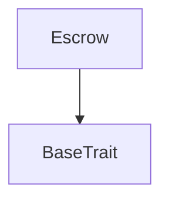

# Tact compilation report
Contract: Escrow
BoC Size: 2928 bytes

## Structures (Structs and Messages)
Total structures: 23

### DataSize
TL-B: `_ cells:int257 bits:int257 refs:int257 = DataSize`
Signature: `DataSize{cells:int257,bits:int257,refs:int257}`

### SignedBundle
TL-B: `_ signature:fixed_bytes64 signedData:remainder<slice> = SignedBundle`
Signature: `SignedBundle{signature:fixed_bytes64,signedData:remainder<slice>}`

### StateInit
TL-B: `_ code:^cell data:^cell = StateInit`
Signature: `StateInit{code:^cell,data:^cell}`

### Context
TL-B: `_ bounceable:bool sender:address value:int257 raw:^slice = Context`
Signature: `Context{bounceable:bool,sender:address,value:int257,raw:^slice}`

### SendParameters
TL-B: `_ mode:int257 body:Maybe ^cell code:Maybe ^cell data:Maybe ^cell value:int257 to:address bounce:bool = SendParameters`
Signature: `SendParameters{mode:int257,body:Maybe ^cell,code:Maybe ^cell,data:Maybe ^cell,value:int257,to:address,bounce:bool}`

### MessageParameters
TL-B: `_ mode:int257 body:Maybe ^cell value:int257 to:address bounce:bool = MessageParameters`
Signature: `MessageParameters{mode:int257,body:Maybe ^cell,value:int257,to:address,bounce:bool}`

### DeployParameters
TL-B: `_ mode:int257 body:Maybe ^cell value:int257 bounce:bool init:StateInit{code:^cell,data:^cell} = DeployParameters`
Signature: `DeployParameters{mode:int257,body:Maybe ^cell,value:int257,bounce:bool,init:StateInit{code:^cell,data:^cell}}`

### StdAddress
TL-B: `_ workchain:int8 address:uint256 = StdAddress`
Signature: `StdAddress{workchain:int8,address:uint256}`

### VarAddress
TL-B: `_ workchain:int32 address:^slice = VarAddress`
Signature: `VarAddress{workchain:int32,address:^slice}`

### BasechainAddress
TL-B: `_ hash:Maybe int257 = BasechainAddress`
Signature: `BasechainAddress{hash:Maybe int257}`

### ConfirmDelivery
TL-B: `confirm_delivery#00000001  = ConfirmDelivery`
Signature: `ConfirmDelivery{}`

### RaiseDispute
TL-B: `raise_dispute#00000002  = RaiseDispute`
Signature: `RaiseDispute{}`

### ResolveToBuyer
TL-B: `resolve_to_buyer#00000003  = ResolveToBuyer`
Signature: `ResolveToBuyer{}`

### ResolveToSeller
TL-B: `resolve_to_seller#00000004  = ResolveToSeller`
Signature: `ResolveToSeller{}`

### CancelIfNoDeposit
TL-B: `cancel_if_no_deposit#00000005  = CancelIfNoDeposit`
Signature: `CancelIfNoDeposit{}`

### ClaimExpired
TL-B: `claim_expired#00000006  = ClaimExpired`
Signature: `ClaimExpired{}`

### EmergencyWithdraw
TL-B: `emergency_withdraw#00000007  = EmergencyWithdraw`
Signature: `EmergencyWithdraw{}`

### RetryPayout
TL-B: `retry_payout#00000009  = RetryPayout`
Signature: `RetryPayout{}`

### TokenNotification
TL-B: `token_notification#7362d09c queryId:uint64 amount:uint128 from:address forwardPayload:remainder<slice> = TokenNotification`
Signature: `TokenNotification{queryId:uint64,amount:uint128,from:address,forwardPayload:remainder<slice>}`

### DepositReceived
TL-B: `deposit_received#00000010 amount:uint128 from:address jettonWallet:address = DepositReceived`
Signature: `DepositReceived{amount:uint128,from:address,jettonWallet:address}`

### TradeCompleted
TL-B: `trade_completed#00000011 buyer:address amount:uint128 fee:uint128 = TradeCompleted`
Signature: `TradeCompleted{buyer:address,amount:uint128,fee:uint128}`

### PayoutRetried
TL-B: `payout_retried#00000012 retriedBy:address queryId:uint64 = PayoutRetried`
Signature: `PayoutRetried{retriedBy:address,queryId:uint64}`

### Escrow$Data
TL-B: `_ seller:address buyer:address admin:address expectedJettonWallet:address amount:uint128 commissionBps:uint16 feeW1:address feeW2:address feeW3:address status:uint8 deposited:uint128 deadline:uint64 jettonWallet:address depositVerified:bool payoutAttempted:bool = Escrow`
Signature: `Escrow{seller:address,buyer:address,admin:address,expectedJettonWallet:address,amount:uint128,commissionBps:uint16,feeW1:address,feeW2:address,feeW3:address,status:uint8,deposited:uint128,deadline:uint64,jettonWallet:address,depositVerified:bool,payoutAttempted:bool}`

## Get methods
Total get methods: 0

## Exit codes
* 2: Stack underflow
* 3: Stack overflow
* 4: Integer overflow
* 5: Integer out of expected range
* 6: Invalid opcode
* 7: Type check error
* 8: Cell overflow
* 9: Cell underflow
* 10: Dictionary error
* 11: 'Unknown' error
* 12: Fatal error
* 13: Out of gas error
* 14: Virtualization error
* 32: Action list is invalid
* 33: Action list is too long
* 34: Action is invalid or not supported
* 35: Invalid source address in outbound message
* 36: Invalid destination address in outbound message
* 37: Not enough Toncoin
* 38: Not enough extra currencies
* 39: Outbound message does not fit into a cell after rewriting
* 40: Cannot process a message
* 41: Library reference is null
* 42: Library change action error
* 43: Exceeded maximum number of cells in the library or the maximum depth of the Merkle tree
* 50: Account state size exceeded limits
* 128: Null reference exception
* 129: Invalid serialization prefix
* 130: Invalid incoming message
* 131: Constraints error
* 132: Access denied
* 133: Contract stopped
* 134: Invalid argument
* 135: Code of a contract was not found
* 136: Invalid standard address
* 138: Not a basechain address
* 1661: Commission must be <= 100%
* 6243: Amount must be > 0
* 6793: Invalid USDT jetton wallet
* 8451: Payout already attempted
* 8823: Only buyer can dispute
* 10550: Deposit must equal trade amount
* 10924: Not pending deposit
* 12978: Invalid status - already resolved
* 14294: Not allowed
* 15210: Only admin can retry payouts
* 16461: Only admin
* 16651: Jetton wallet not set
* 27002: Invalid status
* 35739: Already deposited
* 36840: Only seller can deposit
* 41175: Must be active - already resolved
* 41485: Seller must wait until deadline
* 48201: Deadline not reached
* 50390: No deadline set
* 55532: Only seller can confirm
* 57743: Only admin can resolve
* 60623: No verified deposit
* 62616: Deposit not verified
* 62669: Invalid status for retry
* 63402: Only buyer can claim expired

## Trait inheritance diagram

## Contract dependency diagram

